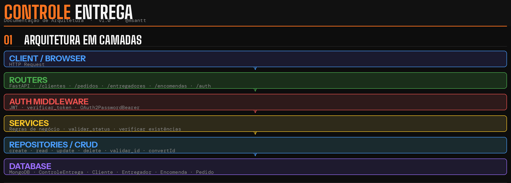
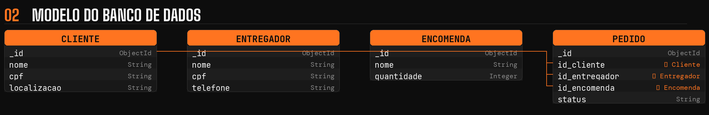
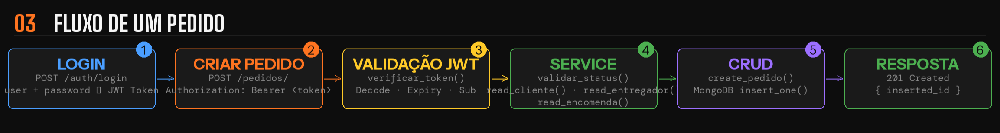

# 📦 ControleEntrega

Sistema de gerenciamento de entregas desenvolvido para portfólio — focado em reduzir perdas, otimizar rotas e garantir rastreabilidade em todo o ciclo logístico.

> Desenvolvido por [@msantt](https://github.com/msantt)

---

## 💡 Sobre o projeto

O ControleEntrega visa solucionar gargalos no processo logístico de empresas, reduzindo perdas de materiais, melhorando a performance de entrega e garantindo responsabilidade em cada etapa do ciclo — do cadastro à confirmação de entrega.

---

## ✅ O que o sistema faz

- Cadastro de clientes, entregadores e encomendas
- Criação e rastreamento de pedidos
- Busca por campo (nome, CPF, status, etc.)
- Paginação de resultados
- Validação de regras de negócio (cliente, entregador e encomenda devem existir para criar pedido)
- Autenticação via JWT (rotas de escrita protegidas)

---

## 🛠 Tecnologias

| Camada | Tecnologia |
|--------|-----------|
| Backend | Python + FastAPI |
| Banco de dados | MongoDB |
| Autenticação | JWT + Passlib (bcrypt) |
| Frontend | HTML + CSS + JavaScript vanilla |

---

## 🏗 Arquitetura





```
backend/
├── app.py              # Entry point
├── database.py         # Conexão MongoDB
├── auth/               # JWT e autenticação
├── models/             # Schemas Pydantic
├── repositories/       # CRUD (acesso ao banco)
├── routers/            # Rotas HTTP por entidade
└── services/           # Regras de negócio

frontend/
├── index.html
├── css/
└── js/
```

---

## 📌 Etapas

- ✅ Modelagem do banco de dados
- ✅ CRUD completo (Cliente, Entregador, Encomenda, Pedido)
- ✅ API REST com FastAPI
- ✅ Arquitetura em camadas
- ✅ Validação de erros (400, 404)
- ✅ Paginação e busca por campo
- ✅ Autenticação JWT
- ✅ Regras de negócio (services)
- 🔄 Interface web (em andamento)